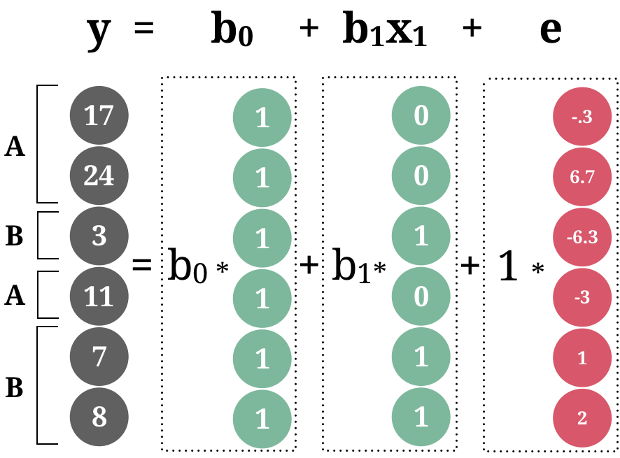

layout: true

<div class="my-footer">
  <span style="text-align:center">
    <span> 
      
    </span>
    <a href="https://therbootcamp.github.io/">
      <span style="padding-left:82px"> 
        <font color="#7E7E7E">
          www.therbootcamp.com
        </font>
      </span>
    </a>
    <a href="https://therbootcamp.github.io/">
      <font color="#7E7E7E">
       Introduction to R | September 2021
      </font>
    </a>
    </span>
  </div> 

---

```{r, eval = TRUE, echo = FALSE, warning=F,message=F}
# Code to knit slides

```

```{r setup, include=FALSE}
options(htmltools.dir.version = FALSE)
options(width = 110)
options(digits = 4)

# Load packages
require(tidyverse)

print2 <- function(x, nlines=10,...) {
   cat(head(capture.output(print(x,...)), nlines), sep="\n")}

# Load data
baselers <- readr::read_csv("1_Data/baselers.csv")

# get color palette functions
source("../../_materials/palette/therbootcamp_palettes.R")
colors = baselrbootcamp_colors

knitr::opts_chunk$set(dpi = 300, echo = FALSE, warning = FALSE, fig.align = 'center', message= FALSE)

```

# General Linear Models

.pull-left4[

<ul>
  <li class="m1"><span>The general linear model is the swiss army knife of statistics.</span></li>
  <li class="m2"><span>This includes:</span></li>
  <ul class="level">
    <li><span><high>Regression</high></li></span>
    <li><span><high>t-Test<high></li></span>
    <li><span><high>Analysis of variance (ANOVA)</high></li></span>
    <li><span>Mediationanalysis</li></span>
    <li><span>Factoranalysis</li></span>
    <li><span>Structural Equatuin Modeling</li></span>
  </ul>
</ul>

]

.pull-right5[

<p align="center">


</p>
]

---

# Categorical Variables

.pull-left4[

<ul>
  <li class="m1"><span>The general linear model can deal with <high>categorical predictors</high>.</span></li>
  <li class="m2"><span>In addition to  <high>dedizierten Tests</high> (e.g., <mono>t.test()</mono>), such predicators can also be added into <mono>lm()</mono>.</span></li>
  <li class="m3"><span>Examples</span></li>
  <ul class="level">
    <li><span><high>Comparison of multiple groups</high></li></span>
    <li><span><high>A/B tests<high></li></span>
  </ul>
</ul>

]

.pull-right5[

```{r, echo = F, fig.width = 3.5, fig.height = 3}

library(tidyverse) ; library(ggrepel)

# Lade Tourismus Daten
tour <- read_csv('1_Data/Tourismus.csv') 
europa <- read_csv('1_Data/Europa.csv') 

# Berechne Nächte per Region
tour = tour %>%
  mutate(Nächte = Besucher * Dauer) %>%
  left_join(europa) %>% 
  mutate(Nächte_log = log2(Nächte),
         Region = stringr::str_trunc(Region, 7, ellipsis = "."))

tour %>%  filter(Region %in% c('Europa','Asien')) %>% 
  ggplot(aes(x = Region, 
             y = Nächte)) +
  scale_y_continuous(trans = 'log2') + 
  geom_boxplot() +
  theme_minimal() 

```

]

---

# `t.test()`

.pull-left4[
<ul>
  <li class="m1"><span>The t-test <high>compares two groups</high> in one continous variable.</span></li>
  <li class="m2"><span>The null-hypothesis states that these groups have <high>identical means</high>.</span></li>
  <li class="m3"><span>Examples</span></li>
  <ul class="level">
    <li><span><high>Comparison of multiple groups</high></li></span>
    <li><span><high>A/B tests<high></li></span>
  </ul>
</ul>

]


.pull-right5[

```{r, echo = T, fig.width = 3.5, fig.height = 3}

t.test(tour$Nächte_log[tour$Region == 'Europa'],
       tour$Nächte_log[tour$Region == 'Asien'])
```


]

---

# `lm()`

.pull-left4[
<ul>
  <li class="m1"><span>The t-test <high>compares two groups</high> in one continous variable.</span></li>
  <li class="m2"><span>The null-hypothesis states that these groups have <high>identical means</high>.</span></li>
  <li class="m3"><span>Examples</span></li>
  <ul class="level">
    <li><span><high>Comparison of multiple groups</high></li></span>
    <li><span><high>A/B tests<high></li></span>
  </ul>
</ul>
]


.pull-right5[

```{r, echo = T, fig.width = 3.5, fig.height = 3}
lm(Nächte_log ~ Region, 
   tour %>% 
     filter(Region %in% c('Europa', 'Asien')))
```

]


---

# Coding

.pull-left4[

<ul>
  <li class="m1"><span>Categorical variables have to be recoded into <high>k-1 new variables</high>.</span></li>
  <li class="m2"><span>Two ways to code this:</span></li>
  <ul>
    <li><span><high>Dummy coding</high> recodes values of one category into 1, else 0<br>&rarr; <high>intercept = 0-category</high></span></li><br>
    <li><span><high>Effect coding</high> recodes values of one category into 1, else -1<br>&rarr; <high>Intercept  =  &#563;  </high></span></li>
  </ul>
</ul>

]

.pull-right5[

<p align="center">


</p>
]

---

# Designmatrix

.pull-left4[

<ul>
  <li class="m1"><span>Categorical variables have to be recoded into <high>k-1 new variables</high>.</span></li>
  <li class="m2"><span>Two ways to code this:</span></li>
  <ul>
    <li><span><high>Dummy coding</high> recodes values of one category into 1, else 0<br>&rarr; <high>intercept = 0-category</high></span></li><br>
    <li><span><high>Effect coding</high> recodes values of one category into 1, else -1<br>&rarr; <high>Intercept  =  &#563;  </high></span></li>
  </ul>
</ul>

]

.pull-right5[

<p align="center">



</p>
]


---

# Designmatrix

.pull-left4[

<ul>
  <li class="m1"><span>Categorical variables have to be recoded into <high>k-1 new variables</high>.</span></li>
  <li class="m2"><span>Two ways to code this:</span></li>
  <ul>
    <li><span><high>Dummy coding</high> recodes values of one category into 1, else 0<br>&rarr; <high>intercept = 0-category</high></span></li><br>
    <li><span><high>Effect coding</high> recodes values of one category into 1, else -1<br>&rarr; <high>Intercept  =  &#563;  </high></span></li>
  </ul>
</ul>

]

.pull-right5[

<p align="center">


</p>
]

---

# Designmatrix

.pull-left4[

<ul>
  <li class="m1"><span>Categorical variables have to be recoded into <high>k-1 new variables</high>.</span></li>
  <li class="m2"><span>Two ways to code this:</span></li>
  <ul>
    <li><span><high>Dummy coding</high> recodes values of one category into 1, else 0<br>&rarr; <high>intercept = 0-category</high></span></li><br>
    <li><span><high>Effect coding</high> recodes values of one category into 1, else -1<br>&rarr; <high>Intercept  =  &#563;  </high></span></li>
  </ul>
</ul>

]

.pull-right5[

<p align="center">


</p>
]


---

# t-Test - three types

.pull-left4[
<ul>
  <li class="m1"><span>The t-test <high>compares two groups</high> in one continous variable.</span></li>
  <li class="m2"><span>The null-hypothesis states that these groups have <high>identical means</high>.</span></li>
  <li class="m3"><span>Examples</span></li>
  <ul class="level">
    <li><span><high>Comparison of multiple groups</high></li></span>
    <li><span><high>A/B tests<high></li></span>
  </ul>
</ul>
]


.pull-right5[

```{r, echo = T, fig.width = 3.5, fig.height = 3}
# Regulärer t-test
t_test <- 
t.test(tour$Nächte_log[tour$Region == 'Europa'],
       tour$Nächte_log[tour$Region == 'Asien'])

# Regression mit dummy
lm_dummy <- lm(
  Nächte_log ~ Region, 
  tour %>% 
    filter(Region %in% c('Europa', 'Asien')))

# Regression mit effect
lm_effect <- lm(
  Nächte_log ~ Region, 
  tour %>% 
    filter(Region %in% c('Europa', 'Asien')),
  contrasts = list(Region = contr.sum))
```

]


---

# t-Test - three types

.pull-left4[
<ul>
  <li class="m1"><span>The t-test <high>compares two groups</high> in one continous variable.</span></li>
  <li class="m2"><span>The null-hypothesis states that these groups have <high>identical means</high>.</span></li>
  <li class="m3"><span>Examples</span></li>
  <ul class="level">
    <li><span><high>Comparison of multiple groups</high></li></span>
    <li><span><high>A/B tests<high></li></span>
  </ul>
</ul>
]


.pull-right5[

```{r, echo = T, fig.width = 3.5, fig.height = 3}
t_test[c('statistic','parameter','p.value')]        %>% unlist

summary(lm_dummy)$coef

summary(lm_effect)$coef
```

]

---

# Multiple Categories

.pull-left4[
<ul>
  <li class="m1"><span>If there are more than two categories <high><mono>k - 1</mono> dummyvariables</high> will be constructed.</span></li>
  <li class="m2"><span>Everything else stays the same.</span></li>
</ul>
]

.pull-right5[
```{r, echo = F, fig.width = 3.5, fig.height = 3}

tour %>%
  ggplot(aes(x = Region, 
             y = Nächte)) +
  scale_y_continuous(trans = 'log2') + 
  geom_boxplot() +
  theme_minimal() +
  theme(axis.text.x = element_text(angle = 45, hjust = 1))

```
]


---

# Multiple categories

.pull-left4[
<ul>
  <li class="m1"><span>If there are more than two categories <high><mono>k - 1</mono> dummyvariables</high> will be constructed.</span></li>
  <li class="m2"><span>Everything else stays the same.</span></li>
</ul>
]

.pull-right5[

<p align="center">


</p>
]


---

# `lm()`

.pull-left35[
<ul>
  <li class="m1"><span>If there are more than two categories <high><mono>k - 1</mono> dummyvariables</high> will be constructed.</span></li>
  <li class="m2"><span>Everything else stays the same.</span></li>
</ul>
]


.pull-right55[

```{r}
options(width=55)
```

```{r, echo = T, fig.width = 3.5, fig.height = 3}
# Regression mit allen Regionen
lm(Nächte_log ~ Region, 
   tour)
```

]


---

# `lm()`

.pull-left35[
<ul>
  <li class="m1"><span>If there are more than two categories <high><mono>k - 1</mono> dummyvariables</high> will be constructed.</span></li>
  <li class="m2"><span>Everything else stays the same.</span></li>
</ul>
]


.pull-right55[

```{r, echo = T, fig.width = 3.5, fig.height = 3}
# Regression mit allen Regionen
mod <- lm(Nächte_log ~ Region, 
          tour)

# Regressionstests
summary(mod)$coef
```

]

---

# `anova()`

.pull-left35[
<ul>
  <li class="m1"><span>Analysis of variance (ANOVA) is a generalization of the t-test and can be understood as a <high>special case of regression</high>.</span></li>
  <li class="m2"><span>The null hypothesis states that all groups have <high>identical means</high>.</span></li>
</ul>
]


.pull-right55[

```{r, echo = T, fig.width = 3.5, fig.height = 3}
# Regression mit allen Regionen
mod <- lm(Nächte_log ~ Region, 
   tour)

# ANOVA tests
anova(mod)
```

]


---

# Post-hoc 

.pull-left35[
<ul>
  <li class="m1"><span>After calulating an ANOVA post-hoc tests identify <high>pairwise group differences</high>.</span></li>
  <li class="m2"><span>Controls for <high>multiple testing</high>.</span></li>
  </ul>
</ul>

<br>

$$q = \frac{\bar{y}_{max}-\bar{y}_{min}}{SE}$$
]

.pull-right55[

```{r, echo = T, fig.width = 3.5, fig.height = 3,message(mosaic)}
# Post-hoc mit Tukey
library(mosaic)
TukeyHSD(mod)$Region
```

]

---

# Interactions

.pull-left35[
<ul>
  <li class="m1"><span>Interactions model <high>moderation effects</high>.</span></li>
  <li class="m2"><span>Moderation: effect of one variable is moderated through another variable.</span></li>
</ul>
]


.pull-right5[

```{r, echo = FALSE, fig.width = 3.5, fig.height = 3}

library(tidyverse) ; library(ggrepel)

# Berechne Nächte per Region
d = read_csv('1_Data/Tourismus.csv') %>%
  mutate(Nächte = Besucher * Dauer) %>%
  left_join(read_csv('1_Data/Europa.csv')) %>% 
  filter(!is.na(Äquivalenzeinkommen)) %>% 
  mutate(Nächte_log = log2(Nächte))

m = lm(Nächte_log ~ Äquivalenzeinkommen + Bevölkerung, data = d %>% mutate(Nächte_log = log2(Nächte)))

res <- 1000

#Setup Axis
x <- seq(min(d$Äquivalenzeinkommen), max(d$Äquivalenzeinkommen), by = res)
y <- seq(min(d$Bevölkerung), max(d$Bevölkerung), by = res)

#Sample points
surface <- expand.grid(Äquivalenzeinkommen = x,
                       Bevölkerung = y, 
                       KEEP.OUT.ATTRS = F)
surface$Nächte_log2 <- predict.lm(m, newdata = surface)
surface <- reshape2::acast(surface, Bevölkerung ~ Äquivalenzeinkommen, value.var = "Nächte_log2")

require(plotly)
plt = plot_ly(d %>% mutate(Nächte_log = log2(Nächte)), 
        x = ~Äquivalenzeinkommen, 
        y = ~Bevölkerung, 
        z = ~Nächte_log,
        type = "scatter3d",
        width = 500, height = 420)

plt = add_trace(p = plt,
          z = surface,
          x = x,
          y = y,
          type = "surface",
        showscale=FALSE) 
plt %>%  layout(showlegend = FALSE)
   

```

]

---

# Interaktions

.pull-left35[
<ul>
  <li class="m1"><span>Interactions model <high>moderation effects</high>.</span></li>
  <li class="m2"><span>Moderation: effect of one variable is moderated through another variable.</span></li>
</ul>
]


.pull-right55[

```{r, echo = T, eval = F, fig.width = 3.5, fig.height = 3}
# Regression mit Interaktion
mod <- 
  lm(Nächte_log ~ Äquivalenzeinkommen * Bevölkerung, 
     tour)

# Regressionstests
summary(mod)$coef
```

```{r, echo = F, fig.width = 3.5, fig.height = 3}
# Regression mit Interaktion
mod <- 
  lm(Nächte_log ~ Äq.Eink. +
                  Bevölk. + 
                  Äq.Eink.:Bevölk. , 
   tour %>% rename(Äq.Eink. = Äquivalenzeinkommen,
                          Bevölk. = Bevölkerung))

# Regressionstests
round(summary(mod)$coef,6)
```


]

---

# Interaktions

.pull-left35[
<ul>
  <li class="m1"><span>Interactions model <high>moderation effects</high>.</span></li>
  <li class="m2"><span>Moderation: effect of one variable is moderated through another variable.</span></li>
</ul>
]


.pull-right55[

```{r, echo = T, eval=FALSE, fig.width = 3.5, fig.height = 3}
# Regression mit Interaktion
mod <- 
  lm(Nächte_log ~ Äquivalenzeinkommen +
                  Bevölkerung + 
                  Äquivalenzeinkommen:Bevölkerung, 
     tour)

# Regressionstests
summary(mod)$coef
```

```{r, echo = F, fig.width = 3.5, fig.height = 3}
# Regression mit Interaktion
mod <- 
  lm(Nächte_log ~ Äq.Eink. +
                  Bevölk. + 
                  Äq.Eink.:Bevölk. , 
     tour %>% rename(Äq.Eink. = Äquivalenzeinkommen,
                     Bevölk. = Bevölkerung))

# Regressionstests
round(summary(mod)$coef,6)
```


]

---

# z-standardization

.pull-left35[
<ul>
  <li class="m1"><span>z-Standardization, i.e., <high>to center and standadize</high>, helps to correctly interpret the data.</span></li>
  <li class="m2"><span>Standardization</span></li>
  <ul class="level">
    <li><span>Standarddeviation = 1</span></li>
    <li><span>Helps to <high>compare effects</high></li></span>
  </ul>
  <li class="m3"><span>Centering</span></li>
  <ul class="level">
    <li><span>Mean = 0</span></li>
    <li><span>Creates <high>independence of the interaction effects</high></li></span>
  </ul>
</ul>

<br>

$$z(x) = \frac{x - \bar{x}}{s}$$
]


.pull-right55[

```{r, echo = T, eval=F, fig.width = 3.5, fig.height = 3}
# Regression mit allen Regionen
mod <- 
  lm(Nächte_log ~ Äquivalenzeinkommen * Bevölkerung, 
     tour %>% mutate_if(is.numeric, scale))

# Regressionstests
summary(mod)$coef
```


```{r, echo = F, fig.width = 3.5, fig.height = 3}
# Regression mit Interaktion
mod <- 
  lm(Nächte_log ~ Äq.Eink. +
                  Bevölk. + 
                  Äq.Eink.:Bevölk. , 
   tour %>% 
     rename(Äq.Eink. = Äquivalenzeinkommen,
                          Bevölk. = Bevölkerung) %>% 
     mutate_if(is.numeric, scale)
     )

# Regressionstests
round(summary(mod)$coef,6)
```


]

---

class: middle, center

<h1><a href="https://dwulff.github.io/Intro2R_Unibe_2021/_sessions/LinearModelsII/LinearModelsII_practical.html">Practical</a></h1>


